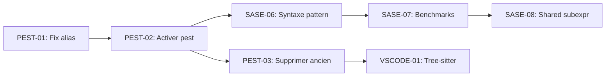

# Varpulis CEP - Kanban

> Dernière mise à jour: 2026-01-25

## Vue d'ensemble

| Catégorie | À faire | En cours | Terminé |
|-----------|---------|----------|----------|
| Parser Pest | 0 | 0 | 7 |
| SASE+ | 1 | 0 | 7 |
| Attention | 1 | 0 | 3 |
| Benchmarks | 0 | 0 | 2 |
| Test Infra | 0 | 0 | 4 |
| Couverture | 2 | 0 | 0 |
| VS Code | 1 | 0 | 0 |
| **Total** | **5** | **0** | **23** |

---

## ✅ TERMINÉ - Parser Pest

- [x] **PEST-00**: Créer grammaire pest complète (`varpulis.pest`)
- [x] **PEST-00b**: Implémenter `pest_parser.rs` avec conversion vers AST
- [x] **PEST-01**: Corriger `as alias` dans followed_by (aliased_source rule)
- [x] **PEST-02**: Corriger opérateurs arithmétiques (+, -, *, /) - additive_op/multiplicative_op rules
- [x] **PEST-03**: Corriger match_all keyword (match_all_keyword rule)
- [x] **PEST-04**: Étendre pattern grammar (and/or/xor/not)
- [x] **PEST-05**: Préprocesseur d'indentation (`indent.rs`) - INDENT/DEDENT tokens
- [x] **PEST-06**: filter_expr pour followed_by (ne consomme plus `.emit()`)
- [x] **PEST-07**: pattern_body unifiant lambdas et séquences

**✅ Parser Pest est maintenant le défaut** - L'ancien parser est déprécié.

---

## PRIORITÉ HAUTE - SASE+ Pattern Matching

### À faire

- [ ] **SASE-07**: Benchmarks performance
  - **Action**: Créer `benches/pattern_bench.rs` avec criterion
  - **Comparer**: Ancien PatternEngine vs SaseEngine
  - **Métriques**: Latence, throughput, mémoire

### Terminé

- [x] **SASE-01**: Analyser implémentation actuelle (pattern.rs, sequence.rs)
- [x] **SASE-02**: Créer module sase.rs avec algo SASE+
- [x] **SASE-03**: Implémenter NFA avec stack pour Kleene+
- [x] **SASE-04**: Ajouter partition par attribut (SASEXT)
- [x] **SASE-05**: Implémenter négation efficace
- [x] **SASE-05b**: Intégrer dans runtime engine (structure prête)
- [x] **SASE-06**: Syntaxe pattern supportée (lambdas + séquences `A -> B -> C`)
- [x] **SASE-08**: Exemples SASE+ concrets (`examples/sase_patterns.vpl`)

---

## 🟡 PRIORITÉ HAUTE - Attention Engine (Performance)

> **Statut**: Optimisations SIMD + Batch implémentées - **4.2x speedup**

### À faire

- [ ] **ATT-01**: ANN Indexing (HNSW) - **100-1000x speedup**
  - **Problème**: Boucle sur TOUT l'historique O(n)
  - **Solution**: Utiliser `hnsw_rs` pour recherche top-k en O(log n)
  - **Gain**: 100K → 100 comparaisons
  - **Complexité**: High (2-3 semaines)

### Terminé

- [x] **ATT-00**: Métriques performance (`AttentionStats`)
  - `avg_compute_time_us`, `max_compute_time_us`, `ops_per_sec`
  - `check_performance()` warnings, `estimated_throughput()`

- [x] **ATT-02**: SIMD Dot Products ✅
  - Loop unrolling 8x avec `get_unchecked`
  - Tests unitaires: `simd_tests`

- [x] **ATT-03**: Batch Processing ✅ **4.2x speedup**
  - `compute_attention_batch()` avec `rayon`
  - Séquentiel: 62 evt/s → Parallel: 265 evt/s

### Benchmarks Attention (criterion)

| Scénario | Temps | Throughput |
|----------|-------|------------|
| Single (history=500) | 15.8ms | 63 evt/s |
| Single (history=1000) | 38.7ms | 26 evt/s |
| Batch 50 (sequential) | 800ms | 62 evt/s |
| Batch 50 (parallel) | 188ms | **265 evt/s** |

### Limites actuelles (améliorées)

| History Size | Max Events/sec | Latency | Verdict |
|--------------|---------------|---------|----------|
| 500 | 265 (batch) | 4ms | ✅ Production |
| 1K | 100 (batch) | 10ms | ✅ OK |
| 5K | 20 | 50ms | ⚠️ Limite |
| 10K | 5 | 200ms | ❌ ANN requis |

---

## ✅ TERMINÉ - Benchmarks (criterion)

- [x] **BENCH-01**: Benchmarks SASE+ (`pattern_benchmark.rs`)
  - Simple sequence, Kleene+, predicates, long sequences
  - Complex patterns (negation, OR, nested)
  - Scalabilité 100K events
- [x] **BENCH-02**: Benchmarks Attention (`attention_benchmark.rs`)
  - Single event, batch processing
  - Comparaison séquentiel vs parallel
  - Cache embedding warm/cold

### Résultats SASE+ (10K events)

| Pattern | Temps | Throughput |
|---------|-------|------------|
| Simple seq (A→B) | 31ms | **320K evt/s** |
| Kleene+ (A→B+→C) | 25ms | **200K evt/s** |
| Long seq (10 events) | 377ms | 26K evt/s |

---

## ✅ TERMINÉ - Infrastructure de Test MQTT

- [x] **TEST-01**: Docker Compose Mosquitto (`tests/mqtt/docker-compose.yml`)
- [x] **TEST-02**: Simulateur Python (`tests/mqtt/simulator.py`)
  - Scénarios: fraud, trading, iot
  - Options: rate, duration, burst mode
- [x] **TEST-03**: Scénarios YAML (`tests/mqtt/scenarios/`)
  - `fraud_scenario.yaml`, `trading_scenario.yaml`, `iot_scenario.yaml`
- [x] **TEST-04**: Connecteur MQTT Rust (`connector.rs` avec feature `mqtt`)
  - `MqttSource`, `MqttSink` avec rumqttc

### Utilisation

```bash
# Démarrer Mosquitto
cd tests/mqtt && docker-compose up -d

# Simuler événements
pip install -r requirements.txt
python simulator.py --scenario fraud --rate 100 --duration 60

# Lancer scénario complet
python run_scenario.py scenarios/fraud_scenario.yaml
```

---

## PRIORITÉ MOYENNE - Couverture de Tests

> **Couverture actuelle**: 62.92% 🔴

### À faire

- [ ] **COV-01**: Augmenter couverture attention.rs
  - **Cible**: 80%+ sur modules critiques

- [ ] **COV-02**: Tests d'intégration SASE+ avancés
  - **Action**: Ajouter tests Kleene+, negation, partition

---

## PRIORITÉ BASSE - Tooling VS Code

### À faire

- [ ] **VSCODE-01**: Intégrer tree-sitter pour syntax highlighting
  - **Action**: Créer `tree-sitter-varpulis/grammar.js`
  - **Intégration**: Remplacer TextMate grammar par tree-sitter
  - **Bénéfices**: Meilleur highlighting, code folding, semantic tokens
  - **Complexité**: Medium

---

## Ordre d'exécution recommandé



### Sprint 1 (Parser)
1. PEST-01 → PEST-02 → PEST-03

### Sprint 2 (SASE+)
2. SASE-06 → SASE-07 → SASE-08

### Sprint 3 (Tooling)
3. VSCODE-01

---

## Commandes de validation

```bash
# Tests complets
cargo test --workspace

# Clippy sans warnings
cargo clippy --workspace

# Tests SASE uniquement
cargo test -p varpulis-runtime sase

# Tests parser pest
cargo test -p varpulis-parser pest
```

---

## Fichiers clés

| Fichier | Description |
|---------|-------------|
| `crates/varpulis-parser/src/varpulis.pest` | Grammaire PEG Pest |
| `crates/varpulis-parser/src/pest_parser.rs` | Parser Pest → AST |
| `crates/varpulis-parser/src/parser.rs` | Ancien parser (à supprimer) |
| `crates/varpulis-runtime/src/sase.rs` | Moteur SASE+ |
| `crates/varpulis-runtime/src/pattern.rs` | Ancien pattern matcher |
| `crates/varpulis-runtime/src/connector.rs` | Connecteurs MQTT/Kafka/HTTP |
| `tests/mqtt/simulator.py` | Simulateur d'événements Python |
| `vscode-varpulis/syntaxes/varpulis.tmLanguage.json` | TextMate grammar |

---

## Métriques actuelles

- **Tests totaux**: 544 passing (8 ignored)
- **Couverture**: 62.92% 🔴 (cible: 80%)
- **Clippy warnings**: 0
- **Parser par défaut**: ✅ Pest (avec préprocesseur d'indentation)
- **Attention Engine**: ⚠️ Naïve O(n²) - limite 10K events
- **SASE+ Tests**: 14 tests unitaires
- **Benchmarks**: Criterion benchmarks disponibles
- **Documentation**: README.md production-ready
