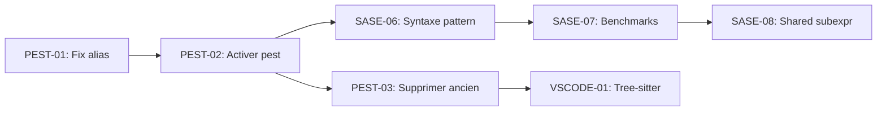

# Varpulis CEP - Kanban

> Dernière mise à jour: 2026-01-25

## Vue d'ensemble

| Catégorie | À faire | En cours | Terminé |
|-----------|---------|----------|----------|
| Parser Pest | 1 | 0 | 5 |
| SASE+ | 3 | 0 | 5 |
| VS Code | 1 | 0 | 0 |
| **Total** | **5** | **0** | **10** |

---

## PRIORITÉ HAUTE - Parser Pest

### À faire

- [ ] **PEST-04**: Corriger parsing blocs indentés (fonctions)
  - **Problème**: Pest ne gère pas l'indentation - les déclarations après une fonction sont incluses dans son corps
  - **Solution possible**: Utiliser un préprocesseur d'indentation ou lalrpop
  - **Complexité**: High

### Terminé

- [x] **PEST-00**: Créer grammaire pest complète (`varpulis.pest`)
- [x] **PEST-00b**: Implémenter `pest_parser.rs` avec conversion vers AST
- [x] **PEST-01**: Corriger `as alias` dans followed_by (aliased_source rule)
- [x] **PEST-02**: Corriger opérateurs arithmétiques (+, -, *, /) - additive_op/multiplicative_op rules
- [x] **PEST-03**: Corriger match_all keyword (match_all_keyword rule)
- [x] **PEST-04**: Étendre pattern grammar (and/or/xor/not)

**Note**: Parser pest fonctionne pour la majorité des cas mais l'ancien parser reste le défaut à cause du problème d'indentation.

---

## PRIORITÉ MOYENNE - SASE+ Pattern Matching

### À faire

- [ ] **SASE-06**: Ajouter syntaxe pattern au parser
  - **Syntaxe cible**:
    ```sql
    pattern FraudDetection = SEQ(Login, Transaction+, Logout)
        within 1h
        partition by user_id
    ```
  - **Fichiers**: `varpulis.pest`, `pest_parser.rs`, `ast.rs`
  - **Complexité**: High

- [ ] **SASE-07**: Benchmarks performance
  - **Action**: Créer `benches/pattern_bench.rs` avec criterion
  - **Comparer**: Ancien PatternEngine vs SaseEngine
  - **Métriques**: Latence, throughput, mémoire

- [ ] **SASE-08**: Optimisation shared subexpression
  - **Description**: Partager les états NFA entre patterns similaires
  - **Exemple**: `SEQ(A, B)` et `SEQ(A, C)` partagent l'état A
  - **Complexité**: High

### Terminé

- [x] **SASE-01**: Analyser implémentation actuelle (pattern.rs, sequence.rs)
- [x] **SASE-02**: Créer module sase.rs avec algo SASE+
- [x] **SASE-03**: Implémenter NFA avec stack pour Kleene+
- [x] **SASE-04**: Ajouter partition par attribut (SASEXT)
- [x] **SASE-05**: Implémenter négation efficace
- [x] **SASE-05b**: Intégrer dans runtime engine (structure prête)

---

## PRIORITÉ BASSE - Tooling VS Code

### À faire

- [ ] **VSCODE-01**: Intégrer tree-sitter pour syntax highlighting
  - **Action**: Créer `tree-sitter-varpulis/grammar.js`
  - **Intégration**: Remplacer TextMate grammar par tree-sitter
  - **Bénéfices**: Meilleur highlighting, code folding, semantic tokens
  - **Complexité**: Medium

---

## Ordre d'exécution recommandé



### Sprint 1 (Parser)
1. PEST-01 → PEST-02 → PEST-03

### Sprint 2 (SASE+)
2. SASE-06 → SASE-07 → SASE-08

### Sprint 3 (Tooling)
3. VSCODE-01

---

## Commandes de validation

```bash
# Tests complets
cargo test --workspace

# Clippy sans warnings
cargo clippy --workspace

# Tests SASE uniquement
cargo test -p varpulis-runtime sase

# Tests parser pest
cargo test -p varpulis-parser pest
```

---

## Fichiers clés

| Fichier | Description |
|---------|-------------|
| `crates/varpulis-parser/src/varpulis.pest` | Grammaire PEG Pest |
| `crates/varpulis-parser/src/pest_parser.rs` | Parser Pest → AST |
| `crates/varpulis-parser/src/parser.rs` | Ancien parser (à supprimer) |
| `crates/varpulis-runtime/src/sase.rs` | Moteur SASE+ |
| `crates/varpulis-runtime/src/pattern.rs` | Ancien pattern matcher |
| `vscode-varpulis/syntaxes/varpulis.tmLanguage.json` | TextMate grammar |

---

## Métriques actuelles

- **Tests totaux**: 544 passing (8 ignored)
- **Clippy warnings**: 0
- **Couverture SASE+**: 14 tests unitaires
- **Parser par défaut**: Pest (avec préprocesseur d'indentation)
- **Benchmarks**: Criterion benchmarks disponibles
- **Documentation**: README.md production-ready
- **Parser migration**: ✅ Complète - hand-written parser déprécié
