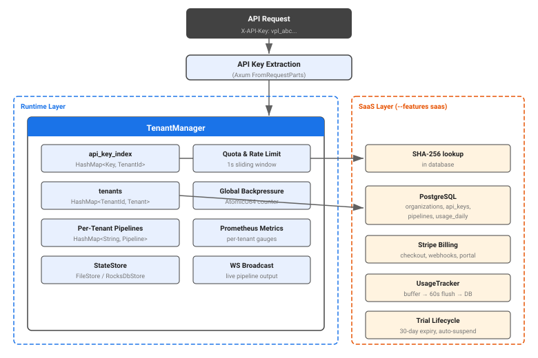
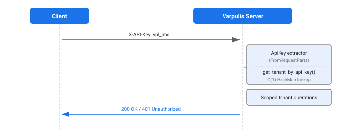
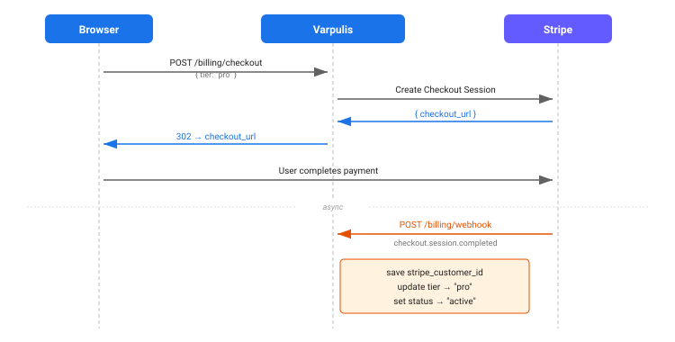

# Multi-Tenancy Architecture

Technical architecture of Varpulis's multi-tenancy system, covering the tenant model, quota enforcement, billing integration, and deployment modes.

## Overview

Varpulis uses a two-layer tenant isolation design: an in-memory runtime layer for lightweight and single-user deployments, and a PostgreSQL-backed database layer for full SaaS operation.



---

## Tenant Model

### Runtime Layer

The in-memory tenant model lives in `crates/varpulis-runtime/src/tenant.rs` and is always active, regardless of deployment mode.

**TenantManager** — central registry for all tenants:

```rust
pub struct TenantManager {
    tenants: HashMap<TenantId, Tenant>,
    api_key_index: HashMap<String, TenantId>,  // O(1) lookup
    store: Option<Arc<dyn StateStore>>,         // persistence backend
    max_queue_depth: u64,                       // 0 = unlimited
    pending_events: Arc<AtomicU64>,             // global backpressure counter
}

pub type SharedTenantManager = Arc<RwLock<TenantManager>>;
```

**Tenant** — represents one isolated tenant with its own pipeline namespace:

```rust
pub struct Tenant {
    pub id: TenantId,
    pub name: String,
    pub api_key: String,
    pub quota: TenantQuota,
    pub usage: TenantUsage,
    pub pipelines: HashMap<String, Pipeline>,  // per-tenant namespace
    pub created_at: Instant,
}
```

**Pipeline** — a deployed VPL program with its own engine instance:

```rust
pub struct Pipeline {
    pub id: String,                                    // UUID
    pub name: String,
    pub source: String,                                // VPL source
    pub engine: Arc<tokio::sync::Mutex<Engine>>,
    pub status: PipelineStatus,                        // Running | Stopped | Error
    pub orchestrator: Option<ContextOrchestrator>,
    pub connector_registry: Option<ManagedConnectorRegistry>,
}
```

### Database Layer (SaaS)

When the `saas` feature is enabled and `DATABASE_URL` is set, Varpulis uses PostgreSQL for durable tenant state. Migrations live in `crates/varpulis-db/migrations/`.

**Core tables:**

| Table | Purpose | Key columns |
|-------|---------|-------------|
| `users` | OAuth user accounts | `id`, `github_id`, `email`, `name` |
| `organizations` | Tenant/org records | `id`, `owner_id`, `name`, `tier`, `status`, `stripe_customer_id`, `trial_expires_at`, limits |
| `api_keys` | Hashed API keys | `id`, `org_id`, `key_hash` (SHA-256), `name`, `last_used_at` |
| `pipelines` | Deployed pipelines | `id`, `org_id`, `name`, `vpl_source`, `status` |
| `usage_daily` | Per-day event counts | `org_id`, `date`, `events_processed`, `output_events` |

All tables with `org_id` use `ON DELETE CASCADE` so removing an organization cleans up all related data.

---

## Tier System

### Runtime Quotas (`TenantQuota`)

| Tier | Max Pipelines | Max EPS | Max Streams/Pipeline |
|------|---------------|---------|----------------------|
| Free | 5 | 500 | 10 |
| Pro | 20 | 50,000 | 100 |
| Business | 100 | 200,000 | 200 |
| Enterprise | 1,000 | 500,000 | 500 |

Constructed via `TenantQuota::free()`, `TenantQuota::pro()`, `TenantQuota::business()`, `TenantQuota::enterprise()`, or dynamically with `TenantQuota::for_tier(tier_str)`.

### SaaS Quotas (Database `organizations` columns)

| Tier | Monthly Event Limit | Pipeline Limit | EPS Limit |
|------|---------------------|----------------|-----------|
| Free | 100,000 | 5 | 500 |
| Pro | 10,000,000 | 20 | 50,000 |
| Business | 100,000,000 | 100 | 200,000 |
| Enterprise | Unlimited | 1,000 | 500,000 |

The `organizations.tier` column (`"free"`, `"pro"`, `"business"`, `"enterprise"`) maps to both runtime `TenantQuota` and the DB-level `pipeline_limit`, `events_per_second_limit`, and `monthly_event_limit` columns. Admins can override individual limits per-org.

---

## Tenant Isolation

### API Key to Tenant Lookup

Every API request includes an `X-API-Key` header (or `Authorization: Bearer/ApiKey`, cookie, or query parameter). The lookup is O(1) via `api_key_index`:

```rust
// TenantManager
pub fn get_tenant_by_api_key(&self, key: &str) -> Option<&TenantId> {
    self.api_key_index.get(key)
}
```

In SaaS mode, API keys are additionally validated against the database using SHA-256 hash comparison:

```rust
pub async fn org_id_for_api_key(&self, raw_key: &str) -> Option<Uuid> {
    let hash = hex::encode(sha2::Sha256::digest(raw_key.as_bytes()));
    let api_key = repo::get_api_key_by_hash(&pool, &hash).await.ok()??;
    Some(api_key.org_id)
}
```

### Pipeline Namespace Isolation

Each tenant owns a separate `HashMap<String, Pipeline>`. The API handler pattern ensures tenants can only access their own pipelines:

```rust
let tenant_id = mgr.get_tenant_by_api_key(&api_key)?;   // 1. identify tenant
let tenant = mgr.get_tenant_mut(&tenant_id)?;            // 2. scope to tenant
let pipeline = tenant.pipelines.get(&pipeline_id)?;      // 3. access pipeline
```

Each pipeline has its own `Arc<Mutex<Engine>>`, `mpsc::Receiver<Event>`, and `broadcast::Sender<Event>` — no cross-tenant data leakage.

### Database-Level Isolation

All tenant-scoped tables carry an `org_id` foreign key to `organizations(id)` with `ON DELETE CASCADE`. Queries always filter by `org_id`.

### Network-Level Isolation (Kubernetes)

The SaaS overlay (`deploy/kubernetes/overlays/saas/network-policies.yaml`) enforces default-deny:

```yaml
# Default deny all ingress
apiVersion: networking.k8s.io/v1
kind: NetworkPolicy
spec:
  podSelector: {}
  policyTypes: [Ingress]

# Default deny all egress (except DNS port 53)
apiVersion: networking.k8s.io/v1
kind: NetworkPolicy
spec:
  podSelector: {}
  policyTypes: [Egress]
  egress:
    - ports:
        - protocol: UDP
          port: 53
```

Explicit allow rules grant:
- Coordinator to PostgreSQL (port 5432, in-namespace)
- Coordinator to external services (Kafka 9092/9093, MQTT 1883/8883, HTTPS 443 for Stripe/GitHub)
- Worker to Coordinator (port 9100) and vice versa (port 9000)
- Ingress controller to Varpulis pods (ports 9000, 9100)

---

## Quota Enforcement

Three enforcement layers protect the system from overload.

### 1. Deployment Quotas

Checked at pipeline deploy time in `Tenant::deploy_pipeline()`:

- **Pipeline count**: `pipelines.len() >= quota.max_pipelines` → `TenantError::QuotaExceeded`
- **Streams per pipeline**: parsed VPL stream count > `quota.max_streams_per_pipeline` → `TenantError::QuotaExceeded`

### 2. Rate Limiting (Per-Tenant Sliding Window)

Each tenant's `TenantUsage` tracks a 1-second sliding window:

```rust
pub fn record_event(&mut self, max_eps: u64) -> bool {
    self.events_processed += 1;
    let now = Instant::now();
    match self.window_start {
        Some(start) if now.duration_since(start).as_secs() < 1 => {
            self.events_in_window += 1;
            if max_eps > 0 && self.events_in_window > max_eps {
                return false;  // TenantError::RateLimitExceeded
            }
        }
        _ => {
            self.window_start = Some(now);
            self.events_in_window = 1;
        }
    }
    true
}
```

Called on every event in `Tenant::process_event()`. When `max_eps == 0`, rate limiting is disabled (unlimited).

### 3. Monthly Usage Limits (SaaS)

The `UsageTracker` buffers event counts in memory and flushes to `usage_daily` every 60 seconds:

```
Events → UsageTracker (in-memory buffer, per org_id)
         │
         ├── 60s interval ──→ drain() → DB upsert (usage_daily)
         │
         └── reload monthly totals + limits from DB
```

Usage is checked against the tier's `monthly_event_limit`. At >80% utilization, an `ApproachingLimit` warning is returned. At 100%, requests receive **429 Too Many Requests** with `Retry-After: 3600`.

### Global Backpressure

An `AtomicU64` counter tracks pending events across all tenants:

```rust
pub fn check_backpressure(&self) -> Result<(), TenantError> {
    if self.max_queue_depth == 0 { return Ok(()); }
    let current = self.pending_events.load(Ordering::Relaxed);
    if current >= self.max_queue_depth {
        return Err(TenantError::BackpressureExceeded { current, max: self.max_queue_depth });
    }
    Ok(())
}
```

The counter is incremented before processing and decremented after. `queue_pressure_ratio()` exposes the ratio as a Prometheus gauge.

---

## Identity & Authentication Flow

### API Key Authentication

The primary path for programmatic access:



Supported header formats: `X-API-Key`, `Authorization: Bearer <key>`, `Authorization: ApiKey <key>`, `Sec-WebSocket-Protocol: varpulis-auth.<key>`, query parameter `?api_key=`.

### Admin Authentication

Admin operations require JWT with `role: "admin"`:
- **CLI mode**: `--admin-password` flag bootstraps an admin user with Argon2-hashed password
- **SaaS mode**: JWT issued via GitHub OAuth carries `role`, `org_id`, and `user_id` claims

### SaaS Session Flow

In SaaS mode, browser sessions use JWT cookies:

1. User authenticates via GitHub OAuth (or OIDC)
2. Server upserts user in `users` table, auto-creates organization if first login
3. JWT issued (HMAC-SHA256, 7-day expiry) with `user_id`, `org_id`, `role` claims
4. JWT stored in `HttpOnly`, `Secure`, `SameSite=Lax` cookie

API keys in SaaS mode are SHA-256 hashed before database storage — raw keys are shown once at creation time and never stored.

---

## Billing Integration

> Feature-gated: `--features saas`. See [Stripe Setup Guide](../guides/stripe-setup.md) for configuration steps.

### Stripe Checkout Flow



### Webhook Events

| Stripe Event | Action |
|-------------|--------|
| `checkout.session.completed` | Save customer ID, upgrade tier, set status "active" |
| `customer.subscription.updated` | Update tier if price changed |
| `customer.subscription.deleted` | Downgrade to "free" tier |

All webhooks are verified using HMAC-SHA256 with `STRIPE_WEBHOOK_SECRET`.

### Billing Endpoints

| Endpoint | Method | Description |
|----------|--------|-------------|
| `/api/v1/billing/usage` | GET | Current month's event usage |
| `/api/v1/billing/plan` | GET | Current tier and event limit |
| `/api/v1/billing/checkout` | POST | Create Stripe Checkout Session |
| `/api/v1/billing/portal` | POST | Create Stripe Customer Portal session |
| `/api/v1/billing/webhook` | POST | Stripe webhook receiver |

### Configuration

| Environment Variable | Purpose |
|---------------------|---------|
| `STRIPE_SECRET_KEY` | Stripe API secret key |
| `STRIPE_WEBHOOK_SECRET` | Webhook signature verification |
| `STRIPE_PRO_PRICE_ID` | Stripe price ID for Pro tier |
| `STRIPE_BUSINESS_PRICE_ID` | Stripe price ID for Business tier |
| `FRONTEND_URL` | Redirect URL after checkout (default: `http://localhost:5173`) |

---

## Trial Lifecycle

### Creation

`create_trial_organization()` inserts a new organization with:
- `status = 'trial'`
- `trial_expires_at = now() + 30 days`
- Free-tier resource limits

### Automatic Expiry

`spawn_trial_expiry_checker()` runs as a background task, checking every hour:

```
Every 60 min:
  SELECT ... FROM organizations
  WHERE status = 'trial'
    AND trial_expires_at IS NOT NULL
    AND trial_expires_at < now()

  → For each expired org: UPDATE status = 'suspended'
```

An index on `(trial_expires_at) WHERE status = 'trial'` ensures efficient lookups.

### Admin Override

Admins can extend or convert trials:
- `PUT /api/v1/admin/tenants/{id}/trial` — set new `trial_expires_at`
- `PUT /api/v1/admin/tenants/{id}/status` — change to `"active"` (bypasses expiry)
- `PUT /api/v1/admin/tenants/{id}/tier` — upgrade tier (e.g., after payment)

---

## Admin Operations

All admin endpoints require JWT with `role: "admin"`. Defined in `crates/varpulis-cli/src/admin.rs`.

| Endpoint | Method | Description |
|----------|--------|-------------|
| `/api/v1/admin/tenants` | GET | List all organizations with usage |
| `/api/v1/admin/tenants/{id}` | GET | Org details with pipelines and API keys |
| `/api/v1/admin/tenants/{id}/tier` | PUT | Change tier (free/pro/business/enterprise) |
| `/api/v1/admin/tenants/{id}/status` | PUT | Change status (active/trial/suspended/revoked) |
| `/api/v1/admin/tenants/{id}/trial` | PUT | Extend trial expiration date |
| `/api/v1/admin/tenants/{id}/limits` | PUT | Override pipeline/EPS/monthly limits |
| `/api/v1/admin/tenants/{id}/revoke` | POST | Revoke tenant (sets status="revoked") |
| `/api/v1/admin/usage` | GET | Aggregate usage across all tenants |

The web UI includes an admin panel for managing tenants without direct API calls.

---

## Deployment Modes

### Single-User (CLI)

```bash
varpulis server --port 9000 --api-key "my-key"
```

- A **default tenant** is auto-provisioned with the provided API key and enterprise-tier quotas
- No database required — state optionally persisted via `FileStore`
- Suitable for development, testing, and single-application deployments

### Multi-Tenant Server

```bash
varpulis server --port 9000 --admin-password "secret"
```

- Admin creates tenants via REST API or web UI
- Each tenant receives its own API key and quota
- Runtime `TenantManager` handles isolation in-memory
- Optional `--state-dir` enables `FileStore` persistence across restarts

### Full SaaS

```bash
# Requires: PostgreSQL, Stripe account, GitHub OAuth app
cargo build --release --features saas

DATABASE_URL=postgresql://... \
STRIPE_SECRET_KEY=sk_... \
GITHUB_CLIENT_ID=... \
GITHUB_CLIENT_SECRET=... \
varpulis server --port 9000
```

- Self-service signup via GitHub OAuth (or OIDC with `--features oidc`)
- Organizations auto-created on first login
- Trial lifecycle with 30-day expiry and auto-suspension
- Stripe billing for tier upgrades
- Usage tracking with 60-second flush to `usage_daily`
- Admin panel for tenant management
- Kubernetes deployment with NetworkPolicies for network isolation

Docker Compose for local SaaS development:
```bash
docker compose -f deploy/docker/docker-compose.saas.yml up -d
```

---

## Persistence & Recovery

### Runtime Layer (FileStore)

When `--state-dir` is provided, `TenantManager` uses `FileStore` for JSON snapshots:

```
FileStore directory layout:
  <state-dir>/tenant/<uuid>       # TenantSnapshot (JSON)
  <state-dir>/tenants/index       # List of tenant IDs (JSON array)
```

Writes are atomic (write to `.tmp`, then rename). `TenantManager::recover()` loads the index and restores all tenants on startup, including pipeline VPL sources (re-compiled into engines).

A `RocksDbStore` backend is also available via `--features persistence` for write-heavy workloads with LZ4 compression and 64 MB write buffers.

### Database Layer (SaaS)

PostgreSQL stores the authoritative tenant state in SaaS mode. Migrations auto-run on startup via sqlx. The connection pool uses up to 20 connections with a 5-second acquire timeout.

---

## File Locations

| Component | File |
|-----------|------|
| TenantManager, Tenant, TenantQuota | `crates/varpulis-runtime/src/tenant.rs` |
| StateStore, FileStore, RocksDbStore | `crates/varpulis-runtime/src/persistence.rs` |
| API routes & ApiKey extractor | `crates/varpulis-cli/src/api.rs` |
| Admin API endpoints | `crates/varpulis-cli/src/admin.rs` |
| Billing & UsageTracker | `crates/varpulis-cli/src/billing.rs` |
| OAuth & JWT sessions | `crates/varpulis-cli/src/oauth.rs` |
| Organization & API key routes | `crates/varpulis-cli/src/org.rs` |
| Local user store & sessions | `crates/varpulis-cli/src/users.rs` |
| DB models & repo queries | `crates/varpulis-db/src/models.rs`, `crates/varpulis-db/src/repo.rs` |
| DB migrations | `crates/varpulis-db/migrations/` |
| Kubernetes NetworkPolicies | `deploy/kubernetes/overlays/saas/network-policies.yaml` |
| SaaS Docker Compose | `deploy/docker/docker-compose.saas.yml` |

---

## See Also

- [Authentication Architecture](authentication.md) — OAuth, OIDC, and JWT session management
- [Stripe Setup Guide](../guides/stripe-setup.md) — Stripe product and webhook configuration
- [Production Deployment](../PRODUCTION_DEPLOYMENT.md) — Deployment checklist and security hardening
- [SSO/OIDC Tutorial](../tutorials/sso-oidc-tutorial.md) — Enterprise SSO provider setup
- [Cluster Architecture](cluster.md) — Distributed coordinator/worker topology
