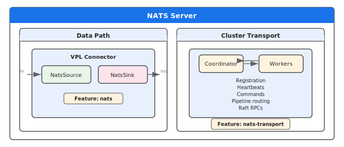
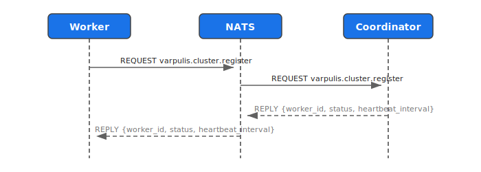
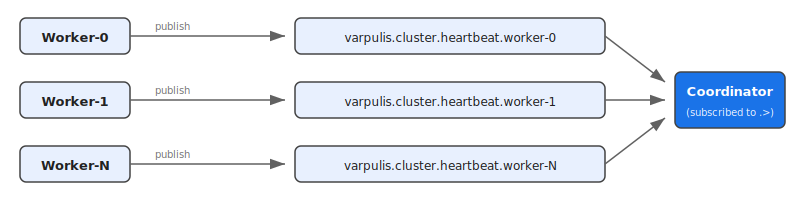
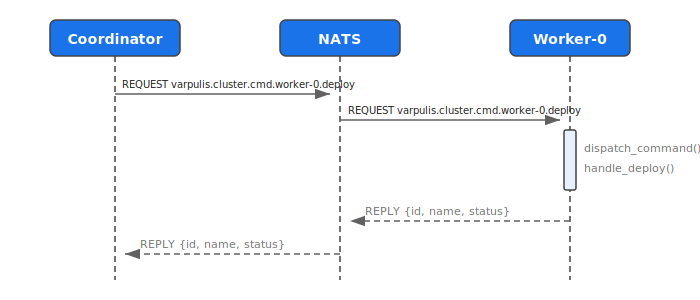
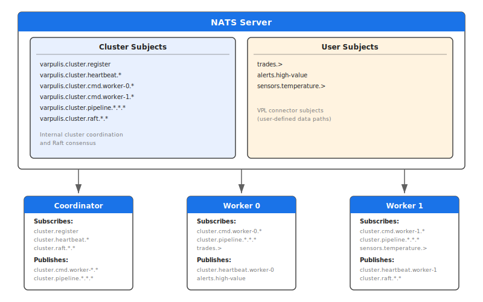

# NATS Transport Architecture

Varpulis uses NATS in two distinct roles: as a **data connector** for event ingestion/output, and as an **internal transport layer** for cluster communication between the coordinator and workers.

## Overview



| Aspect | Data Connector | Cluster Transport |
|--------|---------------|-------------------|
| Purpose | User event streaming (IoT, market data) | Coordinator-worker communication |
| Feature flag | `nats` | `nats-transport` |
| Crate | `varpulis-runtime` | `varpulis-cluster` |
| Subject prefix | User-defined in VPL | `varpulis.cluster.*` |
| Configuration | VPL `connector` declarations | Cluster startup parameters |

---

## Cluster Transport Layer

### Subject Namespace

All cluster subjects use the `varpulis.cluster` prefix. NATS uses `.` as a separator, `*` for single-token wildcard, and `>` for multi-token wildcard.

| Subject Pattern | Direction | Pattern | Purpose |
|----------------|-----------|---------|---------|
| `varpulis.cluster.register` | Worker -> Coordinator | Request/Reply | Worker self-registration |
| `varpulis.cluster.heartbeat.{worker_id}` | Worker -> Coordinator | Pub/Sub | Health monitoring |
| `varpulis.cluster.cmd.{worker_id}.{cmd}` | Coordinator -> Worker | Request/Reply | Pipeline commands |
| `varpulis.cluster.cmd.{worker_id}.>` | (subscription) | Wildcard | Worker subscribes to all its commands |
| `varpulis.cluster.pipeline.{group}.{from}.{to}` | Worker -> Worker | Pub/Sub | Inter-pipeline event routing |
| `varpulis.cluster.raft.{node_id}.{rpc}` | Node -> Node | Request/Reply | Raft consensus RPCs |
| `varpulis.cluster.raft.{node_id}.>` | (subscription) | Wildcard | Node subscribes to all its RPCs |

### Communication Patterns

#### Worker Registration

When a worker starts with NATS transport enabled, it sends a registration request to the coordinator:



Registration payload:
```json
{
  "worker_id": "worker-0",
  "address": "http://localhost:9000",
  "api_key": "test",
  "capacity": {"cpu_cores": 8, "pipelines_running": 0, "max_pipelines": 100}
}
```

Response:
```json
{
  "worker_id": "worker-0",
  "status": "registered",
  "heartbeat_interval_secs": 5
}
```

#### Heartbeats

Workers publish heartbeats on their dedicated subject. The coordinator subscribes to the wildcard `varpulis.cluster.heartbeat.>` to receive all heartbeats:



The coordinator extracts the `worker_id` from the subject's last segment and updates the worker's health metrics.

#### Command Dispatch

The coordinator sends commands to specific workers using request/reply. Each worker subscribes to `varpulis.cluster.cmd.{worker_id}.>`:



Available commands:

| Command | Purpose | Payload |
|---------|---------|---------|
| `deploy` | Deploy a pipeline | `{name, source}` |
| `undeploy` | Remove a pipeline | `{pipeline_id}` |
| `inject` | Send a single event | `{pipeline_id, event_type, fields}` |
| `inject_batch` | Send batch of events | `{pipeline_id, events}` |
| `checkpoint` | Snapshot pipeline state | `{pipeline_id}` |
| `restore` | Restore from checkpoint | `{pipeline_id, checkpoint}` |
| `drain` | Graceful shutdown | `{}` |

---

## Architecture Diagram



---

## Comparison: NATS vs REST Transport

The cluster supports both REST (HTTP) and NATS transport for coordinator-worker communication.

| Feature | REST Transport | NATS Transport |
|---------|---------------|----------------|
| Registration | `POST /api/v1/cluster/workers/register` | `varpulis.cluster.register` (req/reply) |
| Heartbeats | `POST /api/v1/cluster/workers/{id}/heartbeat` | `varpulis.cluster.heartbeat.{id}` (pub) |
| Commands | `POST /workers/{id}/api/v1/...` | `varpulis.cluster.cmd.{id}.{cmd}` (req/reply) |
| Discovery | Workers need coordinator URL | Workers need NATS URL |
| Connection | Point-to-point HTTP | Multiplexed over single NATS connection |
| Overhead | TCP connection per request | Persistent connection, message framing |
| Inter-pipeline | Via MQTT topics | Via `varpulis.cluster.pipeline.*` subjects |

NATS transport is recommended when:
- You already run a NATS server for data connectors
- You need lower-latency command dispatch
- You want a single transport layer for both data and control planes
- You're using NATS for inter-pipeline event routing (replaces MQTT for internal comms)

---

## Deployment

### Requirements

- **nats-server** v2.9+ (recommended: v2.10+ for enhanced JetStream support)
- Default port: 4222
- No JetStream required for basic cluster transport (core NATS is sufficient)

### Starting nats-server

```bash
# Standalone (development)
nats-server

# With monitoring
nats-server -m 8222

# Docker
docker run -d --name nats -p 4222:4222 -p 8222:8222 nats:latest

# Docker Compose (included in Varpulis cluster compose)
# See deploy/docker/docker-compose.cluster.yml
```

### Building with NATS Transport

```bash
# Data connector only
cargo build --release --features nats

# Cluster transport only
cargo build --release --features nats-transport

# Both
cargo build --release --features nats,nats-transport

# Everything
cargo build --release --features all-connectors,nats-transport
```

### Authentication

NATS transport currently supports:
- **No auth** (development)
- **User/password** via connection options
- **Token** authentication

For production, configure authentication on your nats-server:

```
# nats-server.conf
authorization {
  users = [
    {user: "varpulis", password: "secret"}
  ]
}
```

### TLS

TLS is handled by the NATS server configuration. Clients connect using `tls://` URLs:

```
nats-server --tls \
  --tlscert=/path/to/server.crt \
  --tlskey=/path/to/server.key
```

Workers and coordinators connect via `tls://host:4222` instead of `nats://host:4222`.

---

## Crate Structure

The NATS transport implementation spans two crates:

### varpulis-cluster (transport layer)

| File | Purpose |
|------|---------|
| `nats_transport.rs` | Subject helpers, `connect_nats()`, `nats_request()`, `nats_publish()`, `NatsTransportError` |
| `nats_coordinator.rs` | `run_coordinator_nats_handler()` -- registration and heartbeat subscriptions |
| `nats_worker.rs` | `run_worker_nats_handler()` -- command subscription and dispatch |

### varpulis-runtime (data connector)

| File | Purpose |
|------|---------|
| `connector/nats.rs` | `NatsSource`, `NatsSink`, `NatsConfig`, JSON parsing |
| `connector/managed_nats.rs` | `ManagedNatsConnector` -- shared client, health tracking |
| `connector/managed_registry.rs` | Factory: creates NATS connectors from `ConnectorConfig` |

---

## See Also

- [Cluster Architecture](cluster.md) -- Coordinator, workers, placement, REST API
- [Connectors Reference](../language/connectors.md) -- NATS data connector syntax
- [NATS Connector Tutorial](../tutorials/nats-connector.md) -- Step-by-step NATS setup
- [Configuration Guide](../guides/configuration.md) -- NATS configuration options
