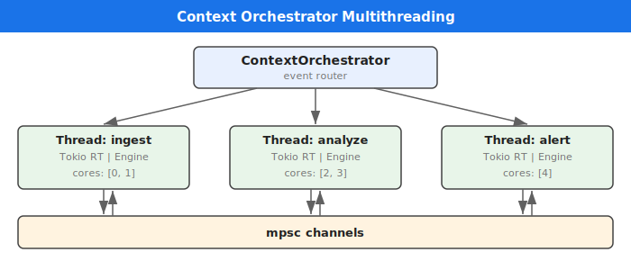
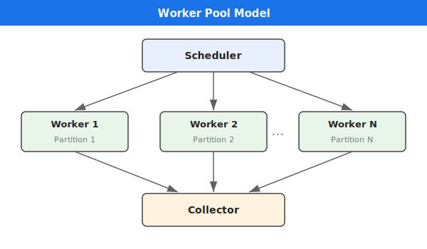

# Parallelization and Supervision

## Context-Based Multi-Threading

Contexts provide OS-level thread isolation for stream processing. Each context runs on a dedicated thread with a single-threaded Tokio runtime, eliminating lock contention within a context.



```varpulis
context ingest (cores: [0, 1])
context analyze (cores: [2, 3])
context alert (cores: [4])

stream RawEvents = Sensor
    .context(ingest)
    .emit(context: analyze, data: data)

stream Stats = RawEvents
    .context(analyze)
    .window(1m)
    .aggregate(avg: avg(value))
    .emit(context: alert, avg: avg)
```

Key properties:
- **No shared state**: All state is thread-local within a context
- **Bounded channels**: Cross-context communication via `mpsc` channels with backpressure
- **CPU affinity**: Optional pinning to specific cores (Linux only, via `core_affinity`)
- **Zero overhead**: Programs without `context` declarations run single-threaded

See the [Contexts Guide](../guides/contexts.md) for a full tutorial.

## Worker Pool Parallelization Model



## Partitioning Strategies

| Strategy | Description | Use Case |
|----------|-------------|----------|
| **consistent_hash** | Stable key hashing | Order guarantee per key |
| **round_robin** | Equal distribution | Load balancing |
| **broadcast** | Send to all workers | Enrichment, reference data |

## Order Guarantees

- **Per partition**: Strict order guaranteed
- **Global**: Approximate order via event timestamps

## Planned Features

The following features are parsed by VPL but not yet evaluated at runtime:

### Parallelization via Contexts

Use contexts for multi-threaded execution with CPU affinity:

```varpulis
context fast_lane (cores: [0, 1])

stream OrderProcessing = Orders
    .context(fast_lane)
    .partition_by(customer_id)
    .where(quantity > 0 and price > 0)
    .emit(order_id: id, total: price * quantity)
```

> **Note:** `.concurrent()`, `.process()`, and `.on_error()` are reserved syntax but not yet implemented. Use contexts and `.partition_by()` for parallelism.

### Automatic Supervision (Planned)

Restart policies, circuit breaker, and health checks are designed but not yet implemented:

- Restart policies: `always`, `on_failure`, `never`
- Exponential backoff
- Circuit breaker (closed → open → half-open)
- Exactly-once semantics via checkpointing + idempotence
