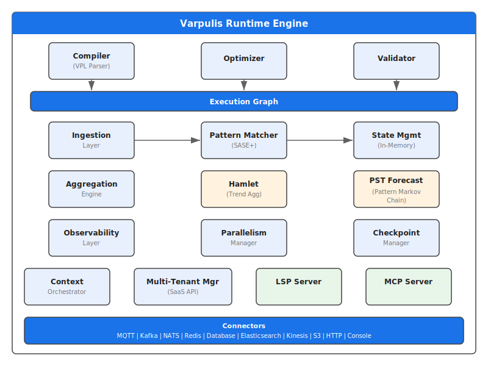
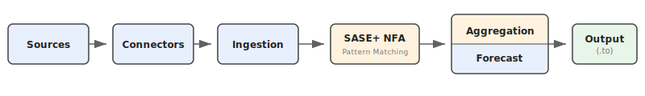

# System Architecture

## Overview

*\* RocksDB requires the `persistence` feature flag: `cargo build --features persistence`*

## Processing Flow

## Components

### Compiler
- Parse VPL via Pest PEG parser
- Generates IR (Intermediate Representation)
- Static optimizations

### Execution Graph
- DAG (Directed Acyclic Graph) of operations
- Intelligent scheduling
- Operator fusion when possible

### Ingestion Layer
- Source connectors (Kafka, files, HTTP, etc.)
- Deserialization (JSON)
- Schema validation

### Pattern Matcher (SASE+ with ZDD)
- NFA-based SASE+ engine for sequence and Kleene pattern detection
- **ZDD** (`varpulis-zdd` crate): compactly represents Kleene capture combinations — e.g., 100 matching events produce ~100 ZDD nodes instead of 2^100 explicit subsets
- Temporal constraints, negation, partition-by support

### State Manager
- See [state-management.md](state-management.md)

### Aggregation Engine (Hamlet)
- Aggregation functions (sum, avg, count, min, max, stddev, etc.)
- Temporal windows (tumbling, sliding, session)
- Key-based grouping
- **Hamlet** (`hamlet/` module): multi-query trend aggregation with graphlet-based sharing — O(1) per-event propagation, 3-100x faster than the experimental `zdd_unified/` aggregation module
- See [trend-aggregation.md](trend-aggregation.md)

> **Note on ZDD modules:** The `varpulis-zdd` crate (used by the Pattern Matcher above) compactly represents Kleene match combinations during *detection*. The `zdd_unified/` module is a separate experimental research module that explored ZDD-based *aggregation* — Hamlet supersedes it for production use.

### Pattern Forecasting (PST)
- **Prediction Suffix Tree** (`pst/` module): variable-order Markov model for pattern completion forecasting
- Online learning — no pre-training required, starts predictions after a configurable warmup period
- **Pattern Markov Chain** (PMC): maps PST predictions onto SASE NFA states to forecast which events complete active sequence patterns
- Sub-microsecond prediction latency (51 ns single symbol, 105 ns full distribution)
- Activated via the `.forecast()` operator in VPL
- See [forecasting.md](forecasting.md)

### Parallelism Manager
- See [parallelism.md](parallelism.md)

### Context Orchestrator
- Named execution contexts with OS thread isolation
- CPU affinity pinning via `core_affinity`
- Cross-context routing via bounded `mpsc` channels
- Zero overhead when no contexts are declared
- See [contexts guide](../guides/contexts.md)

### Observability Layer
- See [observability.md](observability.md)

### Checkpoint Manager
- State snapshots
- Crash recovery
- S3, local filesystem support

### LSP Server
- Language Server Protocol implementation for VPL
- Go-to-definition, find-references, completions, hover docs, semantic tokens
- See [lsp.md](../reference/lsp.md)

### MCP Server
- Model Context Protocol server exposing VPL validation, pipeline management, and engine status to AI assistants
- See [mcp.md](../reference/mcp.md)
