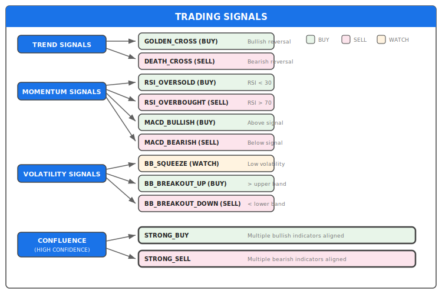
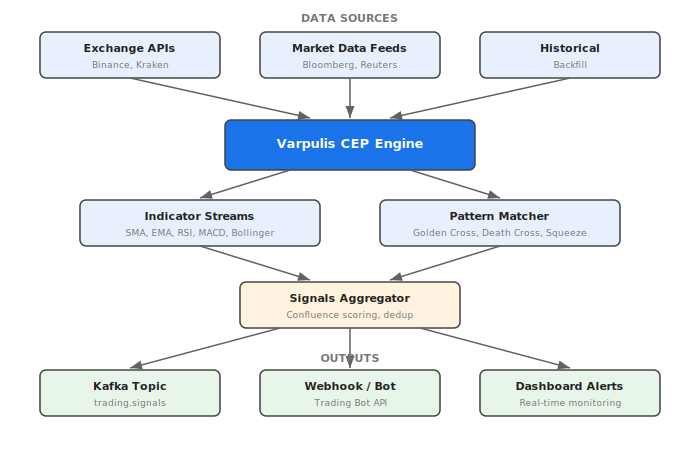

# Use Case: Financial Markets - Technical Analysis

## Overview

Real-time trading signal generation using classic technical indicators and SASE+ pattern detection.

## Target Market

- **Crypto trading** (BTC, ETH, altcoins)
- **Forex** (currency pairs)
- **Equities** (stocks, ETFs)
- **Commodities** (gold, oil, etc.)

## Technical Indicators Implemented

### Trend Indicators

| Indicator | Description | Signal |
|-----------|-------------|--------|
| **SMA (Simple Moving Average)** | Average price over N periods | Trend direction |
| **EMA (Exponential Moving Average)** | Weighted average favoring recent prices | Faster trend detection |
| **Golden Cross** | SMA20 crosses above SMA50 | Bullish reversal |
| **Death Cross** | SMA20 crosses below SMA50 | Bearish reversal |

### Momentum Indicators

| Indicator | Description | Signal |
|-----------|-------------|--------|
| **RSI (Relative Strength Index)** | Measures speed/change of price movements | Overbought (>70) / Oversold (<30) |
| **MACD** | Difference between EMA12 and EMA26 | Trend momentum and crossovers |
| **MACD Histogram** | MACD - Signal line | Momentum strength |

### Volatility Indicators

| Indicator | Description | Signal |
|-----------|-------------|--------|
| **Bollinger Bands** | SMA ± 2 standard deviations | Volatility and breakouts |
| **Bandwidth** | Band width as % of middle band | Squeeze detection |
| **%B** | Price position within bands | Overbought/oversold within bands |

## Signal Types

### Individual Signals



### Confluence Signals

The most powerful signals come from **indicator confluence** - when multiple indicators align:

**Strong Buy Conditions:**
- RSI < 35 (oversold but not extreme)
- %B < 0.2 (price near lower Bollinger Band)
- MACD histogram > 0 (positive momentum)
- SMA20 > SMA50 (uptrend)

**Strong Sell Conditions:**
- RSI > 65 (overbought but not extreme)
- %B > 0.8 (price near upper Bollinger Band)
- MACD histogram < 0 (negative momentum)
- SMA20 < SMA50 (downtrend)

## Architecture



## Example Output

```json
{
  "signal_type": "STRONG_BUY",
  "direction": "BUY",
  "symbol": "BTC/USD",
  "price": 42150.00,
  "confidence": 0.85,
  "indicators": {
    "rsi": 32.5,
    "bb_percent_b": 0.15,
    "macd_histogram": 125.3,
    "trend": "bullish"
  },
  "reason": "Multiple bullish indicators aligned: RSI oversold, price near lower BB, positive MACD histogram, uptrend",
  "timestamp": "2026-01-23T01:15:00Z"
}
```

## Comparison with Traditional Solutions

| Aspect | Traditional (Python/Java) | Varpulis |
|--------|---------------------------|----------|
| **Latency** | 10-100ms | < 1ms |
| **Code complexity** | 500+ lines | ~400 lines (declarative) |
| **Multi-indicator join** | Manual state management | Native stream joins |
| **Pattern detection** | Custom implementation | Built-in SASE+ |
| **Scaling** | Manual threading | Declarative parallelization |
| **Observability** | Add-on libraries | Built-in metrics |

## Risk Disclaimer

⚠️ **This example is for educational purposes only.**

- Technical indicators are lagging and not predictive
- Past performance does not guarantee future results
- Always use proper risk management
- Never invest more than you can afford to lose
- This is not financial advice

## Running the Example

```bash
# Parse and validate
varpulis check examples/financial_markets.vpl

# Run with event file simulation
varpulis simulate -p examples/financial_markets.vpl -e market_data.evt --immediate

# Run with MQTT data source (configured via connectors in the VPL file)
varpulis run --file examples/financial_markets.vpl
```

## See Also

- [VPL Syntax](../language/syntax.md)
- [HVAC Building Example](hvac-building.md)
