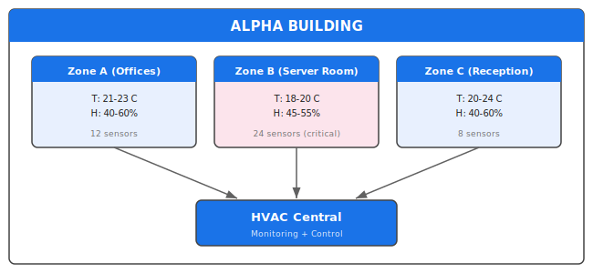
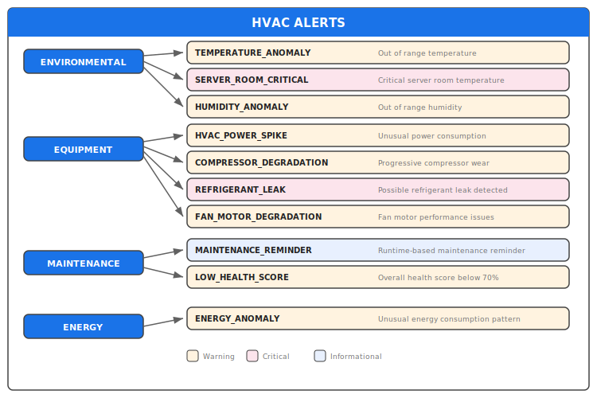

# Use Case: HVAC Building Supervision

## Overview

Smart building supervision with real-time monitoring, anomaly detection, and predictive maintenance for HVAC equipment.

## Business Context

A smart building equipped with IoT sensors to monitor:
- **Temperature** by zone (offices, server room, reception)
- **Humidity** by zone
- **HVAC equipment status** (AHU, air conditioning)
- **Energy consumption**

### Objectives

1. **Temperature anomaly detection** (overheating, under-cooling)
2. **Temperature/HVAC correlation** (is the equipment responding correctly?)
3. **Predictive maintenance** using threshold-based degradation detection
4. **Comfort scoring** by zone
5. **Energy optimization**

## Building Architecture



## Alert Types



## Degradation Detection

Degradation detection uses SASE+ temporal sequence patterns and threshold-based rules to detect progressive equipment degradation.

### Compressor Degradation Pattern

Temporal patterns detect progressive performance decline:

```varpulis
stream CompressorDegradation = HVACMetrics
    .partition_by(unit_id)
    .where(avg_pressure > 14.0 and avg_power > 3.0)
    .emit(
        alert_type: "COMPRESSOR_DEGRADATION",
        severity: "warning",
        unit_id: unit_id,
        zone: zone,
        recommendation: "Schedule preventive maintenance"
    )
```

## Health Score Calculation

Each HVAC unit gets a real-time health score (0-100):

```varpulis
health_score = 100
    - (if avg_power > 5.0 then 10 else 0)           # Power consumption penalty
    - (if pressure out of range then 15 else 0)     # Pressure penalty
    - (if refrigerant_temp > 50 then 20 else 0)     # Temperature penalty
    - (if runtime_hours > 5000 then 10 else 0)      # Age penalty
```

## Example Output

```json
{
  "alert_type": "COMPRESSOR_DEGRADATION",
  "severity": "warning",
  "unit_id": "hvac_unit_01",
  "zone": "server_room",
  "confidence": 0.80,
  "recommendation": "Schedule preventive maintenance - compressor showing signs of wear",
  "reason": "Progressive decline in compressor pressure with increasing power consumption",
  "timestamp": "2026-01-23T01:20:00Z"
}
```

## Running the Example

```bash
# Check syntax
varpulis check examples/hvac_demo.vpl

# Run demo with built-in simulator
varpulis demo --duration 60 --anomalies --degradation --metrics

# Run with custom data source
varpulis run examples/hvac_demo.vpl \
  --source kafka://building-sensors \
  --output kafka://hvac-alerts
```

## Metrics Exposed

| Metric | Description |
|--------|-------------|
| `hvac_alerts_total{type,severity,zone}` | Alert counter |
| `hvac_health_score{unit_id}` | Current health score |
| `hvac_comfort_index{zone}` | Comfort index per zone |
| `hvac_energy_kw{zone}` | Energy consumption |

## See Also

- [Financial Markets Example](financial-markets.md)
- [VPL Syntax](../language/syntax.md)
