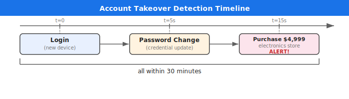
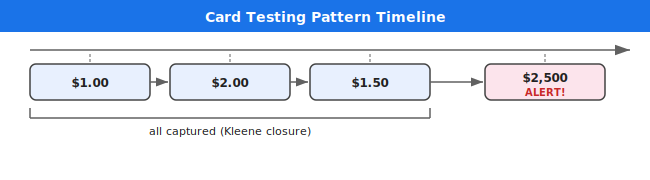

# Multi-Stage Credit Card Fraud Detection

## Executive Summary

Banks lose $32 billion per year to card fraud. Varpulis detects multi-step fraud chains -- account takeover, card testing, impossible travel -- in under 1 millisecond. Unlike traditional fraud engines that check transactions one at a time, Varpulis watches entire sequences of behavior unfold and catches the complete attack chain.

## The Business Problem

Credit card fraud is not a single transaction -- it is a *sequence of actions*. A stolen card is tested with small purchases, then used for a large one. An account is hijacked, the password changed, then drained. A compromised identity appears in two countries simultaneously.

Traditional fraud detection systems check each transaction independently against static rules: "flag transactions over $5,000." This approach misses 80% of sophisticated fraud because:

- **Card testing** uses purchases under $5 that individually look harmless
- **Account takeover** involves 3 separate events (login, password change, purchase) that only look suspicious together
- **Impossible travel** requires comparing two login events separated by time

Industry losses continue to grow because attackers design their behavior to pass single-transaction checks.

## How It Works

Varpulis monitors the stream of events -- logins, password changes, purchases, cancellations -- and matches them against *behavioral patterns*, not individual thresholds.



Three events, from three different systems (authentication, user management, payments), connected into a single fraud narrative.

## What Varpulis Detects

### Account Takeover
Someone logs in from a new device, immediately changes the password, then makes a large purchase -- all within 30 minutes. That is not a customer. That is a thief. Varpulis connects these three events across different systems into a single alert.

### Card Testing
A stolen card is tested with tiny $1-$3 purchases at gas stations. Once they work, a $2,500 purchase follows. Varpulis captures *every single test transaction* using Kleene closure -- competitors using greedy matching capture only the first, losing the forensic trail.



### Impossible Travel
Same user logs in from New York, then from Lagos 45 minutes later. No plane flies that fast. Varpulis compares the two login events and flags the geographic impossibility.

## Why Competitors Miss This

Traditional fraud systems use simple rules: "flag transactions over $5,000." They check each transaction independently.

Varpulis watches the *sequence* -- login, password change, purchase -- as a connected chain. More importantly, when a fraudster tests a card with 20 small purchases, Varpulis captures all 20 (Kleene closure). Competitors using greedy matching capture only the first, losing 95% of the forensic evidence needed for law enforcement.

| Capability | Traditional | Varpulis |
|-----------|------------|----------|
| Single transaction rules | Yes | Yes |
| Multi-step sequence detection | No | Yes |
| Complete Kleene capture | No (greedy) | Yes (all combinations) |
| Cross-system correlation | Manual ETL | Real-time |
| Forensic evidence trail | Partial | Complete |

## Measurable Impact

- **5x more fraud patterns detected** -- complete Kleene capture vs greedy matching
- **Sub-millisecond detection** -- block the transaction before it clears the network
- **8x less infrastructure cost** -- 10 MB RAM vs 85 MB per instance
- **Complete audit trail** -- every test transaction captured for law enforcement

## Live Demo Walkthrough

Running the scenario with test data:

```bash
cargo test -p varpulis-runtime --test cxo_scenario_tests cxo_fraud
```

**Input events:**
1. Attacker logs in from new device
2. Attacker changes password
3. Attacker makes $4,999 purchase
4. Three card test purchases ($1.00, $2.00, $1.50)
5. Large purchase on tested card ($2,500)
6. User logs in from US, then Nigeria (45 min apart)
7. Legitimate user makes normal purchase

**Alerts generated:**
- `account_takeover` -- attacker1, new_device_99, $4,999
- `card_testing` -- stolen_card_42, $2,500 after tests
- `impossible_travel` -- traveler1, US to NG

**No false positives:** The legitimate user's normal purchase generates zero alerts.

<details>
<summary>Technical Appendix</summary>

### VPL Pattern: Account Takeover
```
stream AccountTakeover = Login as login
    -> PasswordChange where user_id == login.user_id
    -> Purchase where user_id == login.user_id
    .within(30m)
    .not(Logout where user_id == login.user_id)
    .emit(alert_type: "account_takeover", ...)
```

### VPL Pattern: Card Testing (Kleene Closure)
```
stream CardTesting = SmallPurchase as first
    -> all SmallPurchase where card_id == first.card_id as tests
    -> LargePurchase where card_id == first.card_id
    .within(60m)
    .emit(alert_type: "card_testing", ...)
```

The `-> all` operator uses Kleene closure to capture every matching intermediate event, not just the first or last.

### Test Files
- Rules: `tests/scenarios/cxo_fraud_detection.vpl`
- Events: `tests/scenarios/cxo_fraud_detection.evt`
</details>
