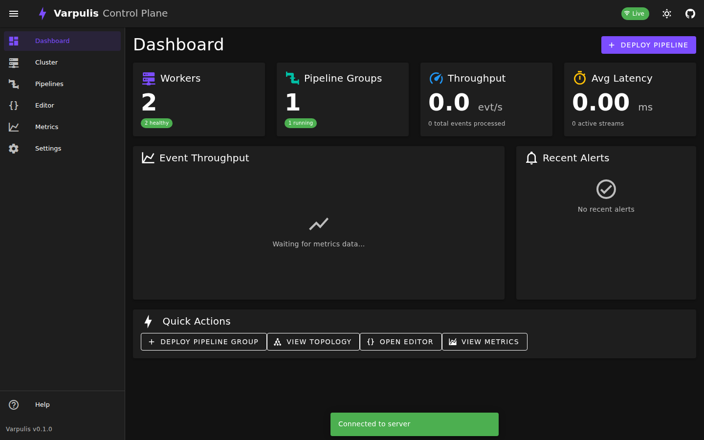
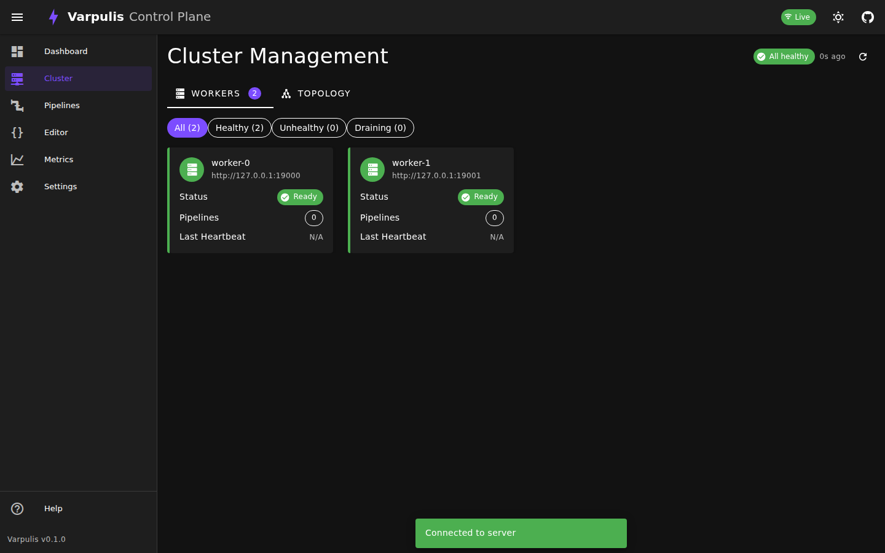
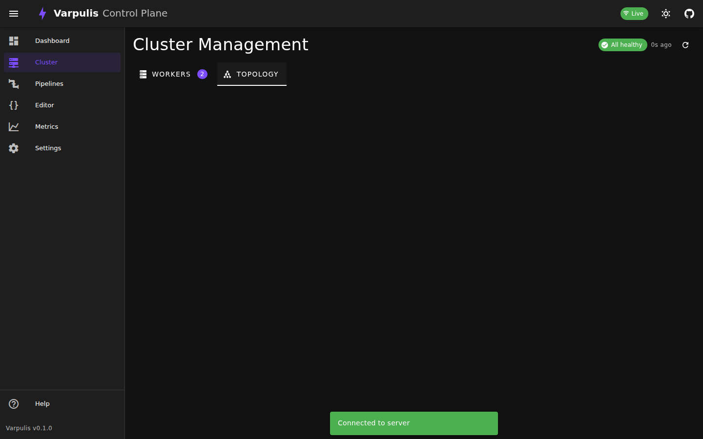
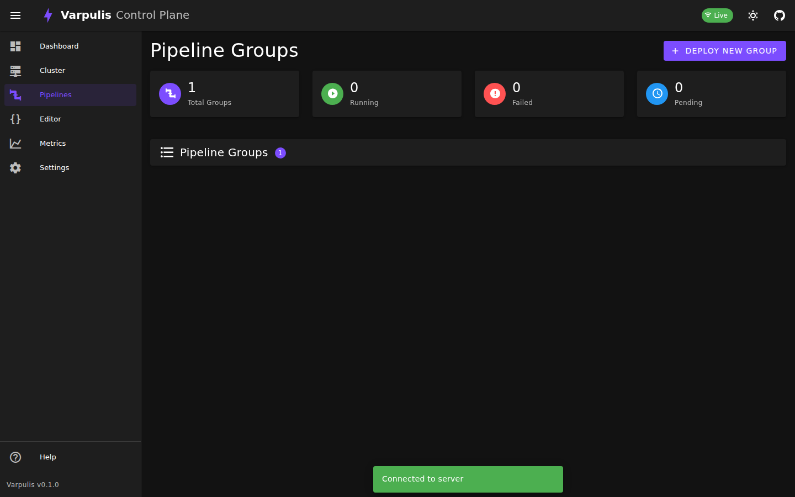
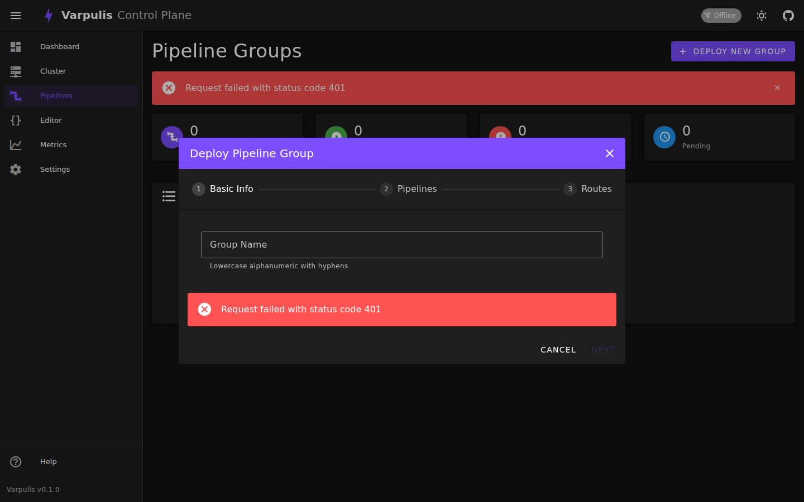
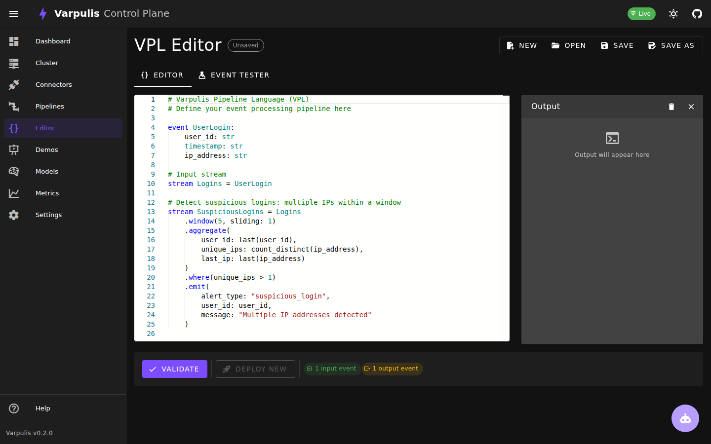
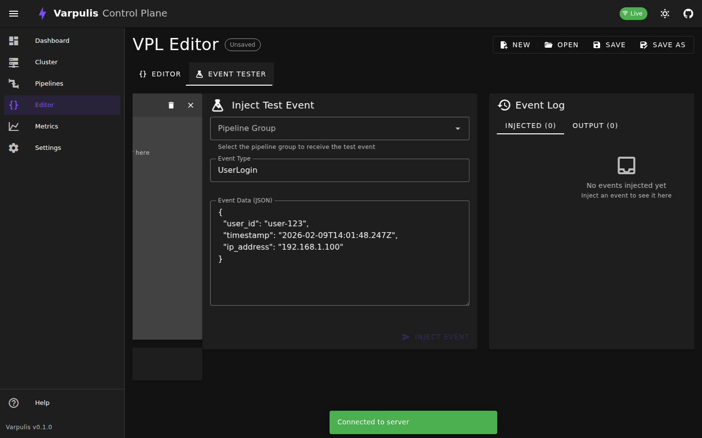
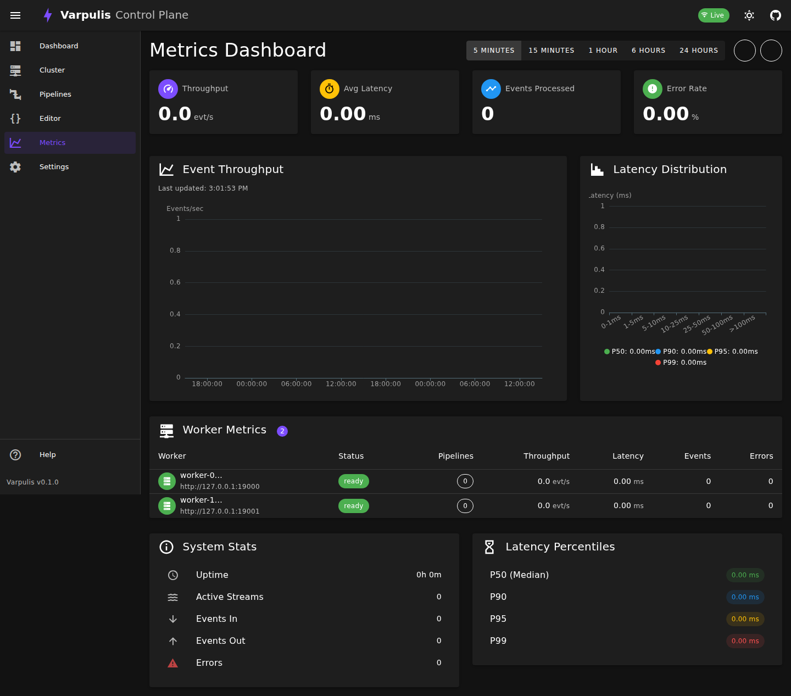
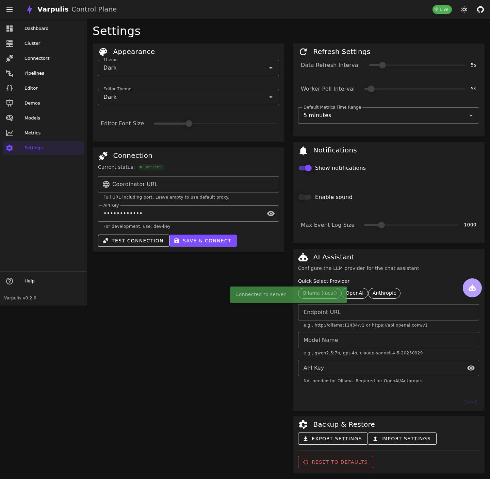

# Varpulis Control Plane - User Guide

The Varpulis Control Plane is a full-featured operational dashboard for monitoring, managing, and debugging your Varpulis event processing cluster.

## Table of Contents

1. [Dashboard](#dashboard)
2. [Cluster Management](#cluster-management)
3. [Pipeline Groups](#pipeline-groups)
4. [VPL Editor](#vpl-editor)
5. [Metrics Dashboard](#metrics-dashboard)
6. [Settings](#settings)

---

## Dashboard

The Dashboard provides a high-level overview of your Varpulis cluster at a glance.



### Key Features

- **Workers Summary**: Shows total workers, healthy/unhealthy counts
- **Pipeline Groups**: Displays running, failed, and pending groups
- **Throughput**: Real-time events per second
- **Latency**: Average processing latency
- **Throughput Chart**: Live event throughput over time
- **Recent Alerts**: Latest system alerts and warnings
- **Quick Actions**: One-click access to common operations

### Summary Cards

| Card | Description |
|------|-------------|
| **Workers** | Total workers with health breakdown |
| **Pipeline Groups** | Active pipeline groups by status |
| **Throughput** | Current events/second rate |
| **Avg Latency** | Mean event processing time |

---

## Cluster Management

The Cluster view provides detailed visibility into your worker nodes and cluster topology.

### Workers View



The Workers tab displays all registered workers as cards:

- **Worker ID**: Unique identifier (truncated for display)
- **Address**: Network address (host:port)
- **Status**: Ready (green), Unhealthy (red), or Draining (yellow)
- **Pipeline Count**: Number of pipelines running on this worker
- **Last Heartbeat**: Time since last health check

#### Worker Actions

Click on any worker card to open the detail panel:

- **View Details**: Full worker information including running pipelines
- **Drain**: Stop accepting new pipelines, migrate existing ones
- **Remove**: Remove worker from the cluster

#### Filtering

Use the filter chips to show:
- All workers
- Healthy workers only
- Unhealthy workers only
- Draining workers only

### Topology View



The Topology tab shows an interactive graph visualization:

- **Nodes**: Each node represents a worker
- **Edges**: Connections show event routing between workers
- **Colors**: Node borders indicate worker health status
- **Zoom/Pan**: Use mouse wheel and drag to navigate
- **Click**: Select a worker to view details

---

## Pipeline Groups

Pipeline Groups organize related pipelines that work together to process events.



### Pipeline List

The main view shows all pipeline groups with:
- **Name**: Group identifier
- **Status**: Running, Deploying, Failed, etc.
- **Pipeline Count**: Number of pipelines in the group
- **Last Updated**: Time of most recent change

### Pipeline Group Details

Click a group to see detailed information:
- Individual pipeline placements
- Worker assignments
- Route configurations
- Metadata

### Deploying a New Group



Click "Deploy New Group" to open the deployment wizard:

#### Step 1: Basic Info
- Enter a unique group name (lowercase, alphanumeric, hyphens)

#### Step 2: Pipelines
- Add one or more pipelines
- Provide VPL source code for each
- Configure affinity rules (any worker, specific worker, or by label)

#### Step 3: Routes
- Define event routing between pipelines
- Specify event types to route
- Add optional filter expressions

### Managing Groups

- **Reload**: Hot-reload pipeline VPL code
- **Teardown**: Stop and remove all pipelines in the group

---

## VPL Editor

The integrated VPL (Varpulis Pipeline Language) editor provides a full development environment.



### Features

- **Syntax Highlighting**: Full VPL syntax support
- **Auto-completion**: Keywords, types, and pattern operators
- **Error Detection**: Basic validation on save
- **Dark Theme**: Optimized for readability

### VPL Language Support

The editor recognizes:
- **Keywords**: `stream`, `event`, `pattern`, `context`, `fn`, `connector`
- **Pattern Operators**: `SEQ`, `AND`, `OR`, `NOT`
- **Stream Clauses**: `from`, `where`, `select`, `emit`, `within`, `window`
- **Types**: `int`, `float`, `bool`, `str`, `timestamp`, `duration`
- **Duration Literals**: `5m`, `1h`, `30s`, `100ms`

### Example VPL Code

```vpl
stream input_events {
    // Input stream configuration
}

event UserLogin {
    user_id: str,
    timestamp: timestamp,
    ip_address: str
}

pattern suspicious_login = SEQ(
    e1: UserLogin,
    e2: UserLogin
) where e1.user_id == e2.user_id
  and e1.ip_address != e2.ip_address
  within 5m;

stream alerts {
    from suspicious_login
    select {
        alert_type: "suspicious_activity",
        user_id: e1.user_id
    }
    emit to "alerts_sink"
}
```

### Event Tester



The Event Tester tab allows you to inject test events:

1. **Select Pipeline Group**: Choose the target group
2. **Event Type**: Specify the event type name
3. **Event Data**: Enter JSON payload
4. **Inject**: Send the event and see the response

The Event Log shows:
- Injected events with timestamps
- Routing results
- Any errors

---

## Metrics Dashboard

The Metrics view provides detailed performance monitoring.



### Time Range Selection

Choose from preset time ranges:
- 5 minutes
- 15 minutes
- 1 hour
- 6 hours
- 24 hours

### Summary Metrics

| Metric | Description |
|--------|-------------|
| **Throughput** | Events processed per second |
| **Avg Latency** | Mean processing time in ms |
| **Events Processed** | Total events since startup |
| **Error Rate** | Percentage of failed events |

### Throughput Chart

Real-time line chart showing:
- Events per second over time
- Smooth trend line
- Interactive tooltips

### Latency Distribution

Histogram showing:
- Latency bucket distribution
- P50, P90, P95, P99 percentile markers

### Worker Metrics Table

Per-worker breakdown:
- Worker ID and address
- Status
- Pipeline count
- Throughput (evt/s)
- Latency (ms)
- Event counts
- Error counts

### System Stats

- **Uptime**: Time since cluster start
- **Active Streams**: Currently active event streams
- **Events In/Out**: Input and output event counts
- **Errors**: Total error count

---

## Settings

Configure the Control Plane behavior and appearance.



### Appearance

- **Theme**: Dark, Light, or System preference
- **Editor Theme**: VS Dark, VS Light, or High Contrast
- **Editor Font Size**: 10-24 pixels

### Connection

- **Coordinator URL**: Override the default coordinator address
- **API Key**: Authentication key for API access

### Refresh Settings

- **Data Refresh Interval**: How often to poll for updates (1-30s)
- **Worker Poll Interval**: Health check frequency (1-60s)
- **Default Metrics Time Range**: Initial time window for charts

### Notifications

- **Show Notifications**: Enable/disable toast messages
- **Enable Sound**: Audio alerts for errors/warnings
- **Max Event Log Size**: Number of events to retain

### Backup & Restore

- **Export Settings**: Download settings as JSON
- **Import Settings**: Upload previously exported settings
- **Reset to Defaults**: Restore all default values

---

## Keyboard Shortcuts

| Shortcut | Action |
|----------|--------|
| `Ctrl+S` | Save/Validate VPL in editor |
| `Ctrl+/` | Toggle comment in editor |
| `Ctrl+Space` | Trigger auto-completion |
| `F11` | Toggle fullscreen |

---

## Troubleshooting

### Connection Issues

**Problem**: "Disconnected" status in app bar

**Solutions**:
1. Verify the coordinator is running
2. Check the coordinator URL in Settings
3. Ensure API key is correct
4. Check browser console for errors

### No Workers Showing

**Problem**: Cluster view shows "No Workers Found"

**Solutions**:
1. Verify workers are started with `--coordinator` flag
2. Check worker logs for connection errors
3. Ensure network connectivity between workers and coordinator

### Metrics Not Updating

**Problem**: Charts show stale or no data

**Solutions**:
1. Check WebSocket connection status
2. Verify auto-refresh is enabled
3. Try clicking the refresh button manually
4. Check browser console for errors

---

## API Reference

The Control Plane communicates with these endpoints:

### Coordinator API

| Endpoint | Method | Description |
|----------|--------|-------------|
| `/api/v1/cluster/workers` | GET | List all workers |
| `/api/v1/cluster/workers/{id}` | GET | Get worker details |
| `/api/v1/cluster/workers/{id}` | DELETE | Remove worker |
| `/api/v1/cluster/pipeline-groups` | GET | List pipeline groups |
| `/api/v1/cluster/pipeline-groups` | POST | Deploy new group |
| `/api/v1/cluster/pipeline-groups/{id}` | DELETE | Teardown group |
| `/api/v1/cluster/pipeline-groups/{id}/inject` | POST | Inject test event |
| `/api/v1/cluster/topology` | GET | Get cluster topology |

### WebSocket

Connect to `/ws` for real-time updates:
- Metrics streams
- Output events
- Worker status changes
- Alerts
